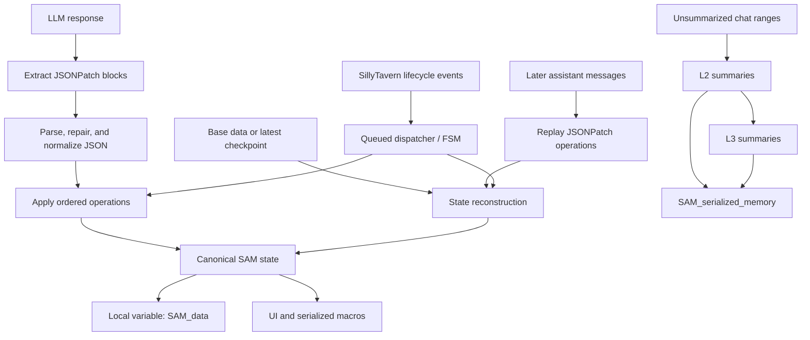
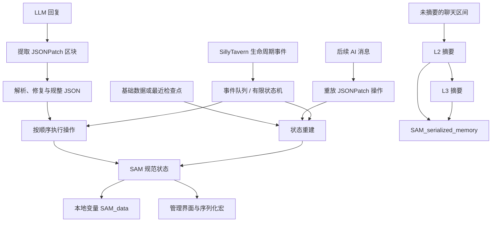

# SAM — Situational Awareness Manager

**Version:** 6.2.14 “Lone Star”  
**Platform:** SillyTavern-compatible script environment  
**Primary script:** `sam_state_manager.js`

> A long-context state persistence and hierarchical memory runtime for conversational LLM applications.

[English](#english) · [中文](#中文)

---

# English

## Overview

SAM is a client-side state and memory runtime for long-running LLM conversations. It was developed for state-heavy roleplay, but its core engineering problems are general:

- preserving canonical state across very long conversations;
- preventing the model from regenerating the entire state on every turn;
- recovering state after message edits, deletion, regeneration, or branch changes;
- processing constrained, machine-readable state mutations;
- compressing older conversation history without discarding current state;
- handling malformed or duplicated model-generated JSON;
- coordinating asynchronous generation and post-processing events.

SAM separates **narrative text**, **structured state**, and **compressed memory**. The LLM produces small state deltas inside `<JSONPatch>` blocks. SAM parses and applies those operations to its canonical state. When a chat is reloaded or altered, SAM reconstructs state from the newest available checkpoint or base state and replays later operations in order.

Version 6.2.14 is an integrated runtime containing:

- an extended JSON Patch processor;
- backward-compatible checkpoint parsing;
- deterministic state reconstruction;
- L2/L3 hierarchical summarization;
- JSON repair and normalization;
- configurable model/API presets;
- user-defined state functions;
- a serialized event dispatcher and runtime finite-state machine;
- generation and UI watchdogs;
- a floating management interface;
- mobile-oriented yielding to reduce interface blocking.

SAM is community software. Back up important chats and state before upgrading or editing the script.

---

## Design goals

SAM is built around five principles.

### 1. State is application data, not prose

Critical state should not depend on the model repeatedly describing it correctly. SAM stores canonical values in a structured object and exposes them to prompts and scripts.

### 2. The model emits deltas

The model normally emits only the changes required by the current turn:

```xml
<JSONPatch>
[
  { "op": "inc", "path": "/player/gold", "value": 10 },
  { "op": "replace", "path": "/world/weather_id", "value": 2 }
]
</JSONPatch>
```

The state engine—not the model—applies the operations.

### 3. State can be reconstructed

SAM can locate the newest supported state block and replay subsequent operations. This makes message edits, regenerations, swipes, deletions, and chat changes recoverable without trusting a stale in-memory copy.

### 4. Memory has multiple resolutions

Recent dialogue can remain in the active context while older ranges are condensed into L2 summaries. Groups of L2 summaries are then condensed into L3 summaries. Structured state remains separate from those lossy summaries.

### 5. Model output is untrusted input

SAM attempts to repair malformed JSON, resolves duplicate object keys, normalizes nested structures, isolates operation failures, and blocks ordinary mutations of read-only fields.

These mechanisms improve resilience; they do not prove that a model-selected value is semantically correct. Domain rules, integer enums, range checks, and transition checks should still be added where correctness matters.

---

## Architecture



### Runtime states

The generation lifecycle is coordinated through four runtime states:

| State | Purpose |
|---|---|
| `IDLE` | Waiting for a user or chat event |
| `AWAIT_GENERATION` | A generation has started and SAM is waiting for completion |
| `PROCESSING` | Parsing and applying the latest assistant message |
| `SUMMARIZING` | Running L2/L3 memory compression |

Events are serialized through an internal queue. Events received during processing or summarization are rejected rather than applied concurrently.

A generation watchdog detects cases where the interface stops generating but the expected completion event is not received. A separate UI heartbeat removes a stale floating window if its runtime instance has disconnected.

---

## Core data model

SAM initializes the following internal structure:

```json
{
  "static": {},
  "time": "",
  "dtime": 0,
  "volatile": [],
  "responseSummary": {
    "L1": [],
    "L2": [],
    "L3": []
  },
  "summary_progress": 0,
  "summary_failed_progress": -1,
  "func": [],
  "events": [],
  "event_counter": 0
}
```

### `static`

`static` contains canonical application or roleplay state. JSON Patch paths are resolved relative to this object.

Example:

```json
{
  "player": {
    "name": "{{user}}",
    "gold": 100,
    "location_id": 1,
    "relationship_state": 0,
    "inventory": []
  },
  "world": {
    "weather_id": 0,
    "alarm_active": 0
  }
}
```

For model-controlled categorical state, integer enums are recommended:

```text
weather_id:
0 = clear
1 = cloudy
2 = rain
3 = storm
```

Integer enums reduce spelling drift and invented textual variants. They do not prevent the model from choosing the wrong valid integer, so use range and transition validation when needed.

### Read-only fields

A leaf key beginning with `_` is treated as read-only for ordinary operations:

```json
{
  "player": {
    "_level": 8
  }
}
```

Only `forced_set` may update such a path. This convention is useful for values derived by configured functions.

### `responseSummary`

Version 6.2.14 actively generates and manages L2 and L3 summaries.

- **L2:** condenses a configured range of chat messages.
- **L3:** condenses a configured number of sequential L2 summaries.
- **L1:** retained in the data schema for compatibility/reserved use; the current runtime does not automatically generate an L1 layer.

### `time` and `dtime`

The `time` operation can store a timestamp and calculate the difference from the previous stored timestamp.

### `volatile`, `func`, and `events`

These fields are retained as part of the state schema and backward-compatible data model. User-defined executable functions are loaded from World Info rather than relying solely on the internal `func` array.

---

## Checkpoints and reconstruction

SAM supports checkpoint-style recovery instead of requiring a full state object in every response.

### Reconstruction procedure

When rebuilding state, SAM:

1. scans backward from the target message;
2. loads the newest supported checkpoint/state block;
3. uses `__SAM_base_data__` when no checkpoint is available;
4. scans forward from that point;
5. extracts every assistant `<JSONPatch>` block;
6. applies operations in message order;
7. normalizes the resulting state;
8. writes the result to the local `SAM_data` variable.

### Supported state block formats

For backward compatibility, SAM recognizes:

```text
$$$$$$data_block$$$$$$
{ ... }
$$$$$$data_block_end$$$$$$
```

and legacy/current V6-style blocks using:

```xml
<SAMCheckpoint>
{ ... }
</SAMCheckpoint>
```

Version 6.2.14 currently persists full state using the `$$$$$$data_block` markers.

### Manual checkpoint

The management interface and registered button event can write the current full state into the latest assistant message. Existing checkpoint blocks in that message are removed before the new block is written.

### Recovery events

SAM rebuilds or synchronizes state after:

- message swipe;
- regeneration;
- message deletion;
- message editing;
- chat change;
- manual reset;
- initial context loading.

---

## Extended JSON Patch format

Place one or more operations inside a `<JSONPatch>` block:

```xml
<JSONPatch>
[
  { "op": "replace", "path": "/player/location_id", "value": 4 },
  { "op": "inc", "path": "/player/gold", "value": 25 }
]
</JSONPatch>
```

Paths use JSON Pointer syntax and are relative to `SAM_data.static`.

### Supported operations

| Operation | Required fields | Behaviour |
|---|---|---|
| `replace` | `path`, `value` | Sets a value at the path |
| `forced_set` | `path`, `value` | Sets a value and may update `_` read-only fields |
| `remove` | `path` | Removes the value at the path |
| `insert` | `path`, `value` | Sets a value; a path ending in `/-` appends to an array |
| `delta` | `path`, `value` | Adds a numeric delta |
| `inc` | `path`, `value` | Alias-like numeric increment |
| `mul` | `path`, `value` | Multiplies the current numeric value |
| `min` | `path`, `value` | Replaces the current value when the new value is smaller |
| `max` | `path`, `value` | Replaces the current value when the new value is larger |
| `push` | `path`, `value` | Appends one value or an `$each` array |
| `addToSet` | `path`, `value` | Appends only values not already deeply equal to an existing item |
| `pull` | `path`, `value` | Removes matching array values or matching objects |
| `pop` | `path`, `value` | `1` removes the last array item; `-1` removes the first |
| `move` | `path` or `from`, `to` | Moves a value to another path |
| `time` | `value` | Stores a timestamp and updates `dtime` |
| `func` | `func_name`, optional `params` | Runs a configured function against the state |

### Examples

#### Replace a categorical integer flag

```xml
<JSONPatch>
[
  { "op": "replace", "path": "/world/weather_id", "value": 2 }
]
</JSONPatch>
```

#### Increment a numeric value

```xml
<JSONPatch>
[
  { "op": "inc", "path": "/player/gold", "value": 10 }
]
</JSONPatch>
```

#### Add an item only once

```xml
<JSONPatch>
[
  {
    "op": "addToSet",
    "path": "/player/inventory",
    "value": {
      "id": 17,
      "name": "Archive Key"
    }
  }
]
</JSONPatch>
```

#### Append several items

```xml
<JSONPatch>
[
  {
    "op": "push",
    "path": "/quest_log",
    "value": {
      "$each": [
        { "id": 41, "status": 0 },
        { "id": 42, "status": 0 }
      ]
    }
  }
]
</JSONPatch>
```

#### Call a configured function

```xml
<JSONPatch>
[
  {
    "op": "func",
    "func_name": "recalculate_stats",
    "params": []
  }
]
</JSONPatch>
```

### Error handling

Each operation is applied inside its own error boundary. A failed operation is logged without necessarily terminating the entire block.

Malformed JSON is processed through:

1. duplicate-aware parsing;
2. dynamic loading of `jsonrepair` when required;
3. reparsing;
4. recursive normalization.

SAM also normalizes arrays of identifiable objects. When repeated entries contain a usable identity field such as `name`, `func_name`, `id`, `key`, or `title`, it attempts to merge duplicates.

---

## Hierarchical memory

SAM is designed for conversations whose full history is too large or too repetitive to keep at full fidelity.

### L2 summaries

L2 processing:

1. starts at `summary_progress`;
2. reads the next configured message range;
3. removes state blocks and `<JSONPatch>` blocks from narrative input;
4. applies user-configured cleanup regexes;
5. provides the current serialized state and cleaned chat range to the summary prompt;
6. stores the returned narrative summary with its source message range;
7. advances `summary_progress`.

The default L2 frequency is 20 messages.

The default prompt also asks the model to identify new state information and emit JSON Patch instructions. The stored L2 text removes those patch blocks; state mutations remain handled separately.

### L3 summaries

When enough L2 entries accumulate, SAM sends a sequential group of L2 summaries to the L3 prompt and stores a higher-level narrative.

The default L3 frequency is five L2 summaries.

Each generated L3 entry retains a copy of its source L2 items. This supports later inspection and rewriting.

### Summary management

The UI supports:

- editing L2 and L3 prompts;
- configuring summary frequencies;
- manually running pending summaries;
- previewing the next L2 prompt;
- rewriting an existing L2 or L3 summary;
- deleting individual summaries;
- selecting a separate model/API preset for summarization;
- optionally skipping World Info activation during summary generation;
- cleaning summary input with configurable regular expressions.

### Memory macro

`{{SAM_serialized_memory}}` returns L2 and L3 summaries sorted by source range:

```text
[L2 Summary | Range: 0-20]: ...
[L3 Summary | Range: 0-100]: ...
```

This can be inserted into a prompt or World Info entry to provide compressed historical memory.

---

## State access and macros

SAM writes the normalized runtime state to the local variable:

```text
SAM_data
```

It also registers two macros:

| Macro | Output |
|---|---|
| `{{SAM_serialized_db}}` | Pretty-printed contents of `SAM_data.static` |
| `{{SAM_serialized_memory}}` | Ordered L2/L3 summary text |

The exact syntax for reading nested local variables depends on the surrounding SillyTavern script/template environment. The registered serialized macros are the stable integration surface provided directly by version 6.2.14.

---

## Model and API connections

Summary generation can use:

- the active SillyTavern generation backend; or
- a configured custom preset routed through SillyTavern’s chat-completions backend.

The UI exposes presets for providers and compatible routes including:

- OpenAI-compatible custom endpoints;
- Google MakerSuite / Gemini;
- Anthropic Claude;
- Mistral;
- OpenRouter;
- Cohere;
- Perplexity;
- Groq;
- DeepSeek;
- 01.AI;
- NanoGPT;
- AI/ML API;
- xAI;
- Pollinations;
- Vertex AI;
- AI21.

A preset may configure the endpoint, model, API key, proxy password, maximum tokens, temperature, top-p, frequency penalty, and presence penalty.

API compatibility ultimately depends on the installed SillyTavern version and backend route.

---

## Configured functions

SAM can load a function library from World Info. Functions can update state directly and can be invoked by a `func` operation.

Example World Info content:

```json
[
  {
    "func_name": "hunger_decay",
    "func_params": [],
    "func_body": "if (state.static.player.hunger > 0) state.static.player.hunger -= 1;",
    "periodic": true,
    "timeout": 2000,
    "network_access": false
  },
  {
    "func_name": "award_gold",
    "func_params": ["amount"],
    "func_body": "state.static.player.gold += Number(amount) || 0;",
    "periodic": false,
    "timeout": 2000,
    "network_access": false
  }
]
```

### Function fields

| Field | Meaning |
|---|---|
| `func_name` | Function identifier used by `func` operations |
| `func_params` | Positional parameter names; a name prefixed by `...` becomes a rest parameter |
| `func_body` | JavaScript function body |
| `periodic` | When true, the function runs after each processed assistant generation |
| `timeout` | Promise-level timeout in milliseconds; default is 2000 |
| `network_access` | When true, supplies `window.fetch`; otherwise the supplied `fetch` throws |

Changes made by a configured function during live generation are diffed and converted into `forced_set`/`remove` operations so they survive later history replay.

### Security warning

Configured functions use JavaScript `new Function`. This is **not a security sandbox**.

- Only run function definitions you trust.
- `network_access: false` restricts the supplied `fetch` reference but does not create a hardened isolation boundary.
- A `Promise.race` timeout cannot forcibly interrupt a synchronous infinite loop.
- Do not expose function editing to untrusted users.
- Do not use this execution mechanism for hostile or multi-tenant input.

---

## Installation

### Prerequisites

You need:

1. SillyTavern;
2. a compatible script host/helper environment that provides the APIs used by `sam_state_manager.js`, including the 酒馆助手 / JS-Slash-Runner-style integration;
3. a character associated with a World Info/worldbook;
4. a model capable of following the `<JSONPatch>` output contract.

The exact helper-plugin name and installation procedure can vary by SillyTavern setup. Version 6.2.14 expects functions such as event registration, variable updates, chat-message updates, raw generation, and worldbook access to be available.

### Install the script

1. Open the compatible script manager or Quick Replacer interface.
2. Create a new JavaScript script.
3. Copy the complete contents of `sam_state_manager.js`.
4. Enable the script.
5. Reload SillyTavern or switch back to the target chat.

SAM removes handlers and UI from an older runtime instance before starting the new instance, which supports script hot-reloading.

### Activate SAM in World Info

SAM only activates for a character whose associated World Info contains an entry with the comment:

```text
__SAM_IDENTIFIER__
```

For compatibility with the function editor, set both the entry name and comment to `__SAM_IDENTIFIER__`.

The entry content should be a JSON array of configured functions. Use an empty array when no functions are required:

```json
[]
```

### Optional base state

Create another World Info entry with the comment:

```text
__SAM_base_data__
```

The content should be the initial value of `SAM_data.static`, not the entire internal SAM wrapper:

```json
{
  "player": {
    "name": "{{user}}",
    "gold": 100,
    "location_id": 0,
    "relationship_state": 0,
    "inventory": []
  },
  "world": {
    "weather_id": 0,
    "alarm_active": 0
  }
}
```

When no checkpoint exists, SAM uses this object as the base and replays later patches.

### Add the patch contract to your prompt

A minimal instruction is:

```text
When the canonical state changes, append exactly one <JSONPatch> block to the end
of the response. Output only valid JSON operations inside the block. Paths are
relative to the static state root. Use integer values for categorical flags.
Do not reproduce the complete state.
```

Example model output:

```text
The rain begins as the group reaches the north gate.

<JSONPatch>
[
  { "op": "replace", "path": "/world/weather_id", "value": 2 },
  { "op": "replace", "path": "/player/location_id", "value": 7 }
]
</JSONPatch>
```

---

## Management interface

The floating SAM manager provides access to:

- summary configuration and execution;
- L2/L3 summary inspection and rewriting;
- direct state inspection/editing;
- API connection presets;
- configured functions;
- summary-input regular expressions;
- global settings;
- settings import/export;
- manual checkpoint creation;
- internal state reset;
- runtime and dependency status.

The UI is designed as a large movable panel and includes special yielding delays for mobile devices.

---

## Reliability characteristics

Version 6.2.14 includes several defensive mechanisms:

- cleanup of event handlers during hot reload;
- serialization of lifecycle events through a queue;
- processing locks;
- cached pre-generation state;
- reconstruction after history mutations;
- generation-completion watchdog;
- stale-UI heartbeat cleanup;
- per-operation exception handling;
- JSON repair;
- duplicate-key resolution;
- recursive state normalization;
- read-only-field convention;
- deduplication of identifiable object arrays;
- removal of duplicate patch blocks from processed responses;
- backward-compatible checkpoint parsing.

These features improve operational resilience but do not replace application-specific validation.

For higher-assurance deployments, add:

- JSON Schema validation;
- integer enum ranges;
- allowed state-transition tables;
- authorization checks for sensitive paths;
- idempotency keys for external actions;
- immutable audit logs;
- automated reconstruction and regression tests;
- dependency pinning and integrity checks;
- isolated execution for configured code.

---

## Known limitations

1. **Semantic correctness is not guaranteed.**  
   Valid JSON can still contain the wrong path or wrong valid value.

2. **Configured functions are trusted code.**  
   `new Function` is not a hardened sandbox.

3. **Checkpoint data is embedded in chat content.**  
   It is not encrypted and may contain sensitive state.

4. **API credentials are handled in the client/SillyTavern settings environment.**  
   Use only endpoints and environments you trust.

5. **`jsonrepair` is loaded dynamically from a CDN.**  
   Offline use or strict supply-chain requirements may require bundling and pinning the dependency.

6. **Promise timeouts cannot interrupt synchronous infinite loops.**

7. **L1 is reserved rather than automatically generated in the current runtime.**

8. **Provider compatibility depends on the surrounding SillyTavern backend.**

9. **The runtime is currently distributed as a large integrated script.**  
   State, memory, adapters, UI, and styling are not yet separated into independent modules.

---

## Troubleshooting

### The SAM icon does not appear

Verify that:

- the character has an associated World Info;
- an entry comment is exactly `__SAM_IDENTIFIER__`;
- the function-library entry contains valid JSON, usually `[]`;
- the helper script environment is enabled;
- the browser console does not report missing SillyTavern/helper APIs.

### State did not update

Check that:

- the assistant output contains `<JSONPatch>...</JSONPatch>`;
- the block contains valid JSON;
- each path begins with `/`;
- the path is relative to `static`;
- the target field is not read-only;
- the generation was not a dry run;
- the model did not place the operation outside the patch block.

Use the internal reset/synchronization control after manually editing an older message.

### A patch block was skipped

SAM logs malformed blocks and attempts JSON repair. Check the browser console for the original parsing error and repaired-content failure.

### A summary did not run

Check:

- SAM is active for the current World Info;
- data processing is enabled;
- enough unsummarized messages exist to reach the L2 threshold;
- the selected summary API preset is valid;
- the configured model can return the requested format.

### A summary contains state commands

The default L2 prompt may request JSON Patch instructions. SAM removes `<JSONPatch>` blocks before storing the narrative summary. State commands should be processed separately by the state engine.

### State changed after editing or regenerating a message

This is expected. SAM reconstructs state from the available checkpoint/base state and replays the operations that remain in the edited history.

---

## Suggested repository structure for future releases

The current single-file distribution is convenient for installation. Development would be easier to test and review if the source were split before being bundled:

```text
src/
  state/
    reducer.js
    reconstruction.js
    normalization.js
  memory/
    l2-summarizer.js
    l3-summarizer.js
  parsing/
    patch-parser.js
    json-repair.js
  runtime/
    dispatcher.js
    watchdog.js
  adapters/
    sillytavern.js
    model-api.js
    world-info.js
  ui/
    panel.js
    styles.css
tests/
dist/
  sam_state_manager.js
```

---

## Version note: 6.2.14 “Lone Star”

This README documents behaviour present in the 6.2.14 integrated script, including:

- `<JSONPatch>` extraction and extended operations;
- canonical-state normalization;
- duplicate-aware JSON parsing;
- optional JSON repair;
- latest-checkpoint/base-state reconstruction;
- forward replay from chat history;
- L2/L3 summaries with rewrite support;
- configurable provider presets;
- periodic and invoked state functions;
- queued lifecycle dispatch;
- generation and UI watchdogs;
- World Info activation and base data;
- `SAM_serialized_db` and `SAM_serialized_memory` macros;
- backward compatibility with earlier state-block formats.

---

# 中文

## 项目概述

SAM（Situational Awareness Manager，态势感知管理器）是一个面向长上下文 LLM 对话的客户端状态与记忆运行时。它最初用于高状态密度的 AI 角色扮演，但所解决的工程问题具有普适性：

- 在超长对话中保存规范化、可重建的状态；
- 避免模型在每一轮重新输出完整状态；
- 在消息编辑、删除、重生成、Swipe 或切换聊天后恢复状态；
- 处理受约束、可机器读取的状态变更指令；
- 在不丢失当前结构化状态的前提下压缩旧对话；
- 修复或规整模型生成的错误 JSON；
- 协调异步生成事件与生成后的状态处理。

SAM 将**叙事文本**、**结构化状态**与**压缩记忆**分离。模型只需在 `<JSONPatch>` 区块中输出轻量级状态增量；SAM 负责解析并将这些操作应用到规范状态。当聊天重新载入或历史被修改时，SAM 会从最近的检查点或基础数据重建状态，并按顺序重放之后的操作。

6.2.14 版“Lone Star”集成了：

- 扩展 JSON Patch 处理器；
- 向后兼容的检查点解析；
- 确定性的状态重建；
- L2/L3 分层摘要；
- JSON 修复与树结构规整；
- 可配置的模型/API 预设；
- 用户定义状态函数；
- 串行事件调度器与有限状态机；
- 生成监视器与 UI 心跳监视器；
- 浮动管理界面；
- 面向移动端的主动让出执行，以减少界面卡顿。

SAM 属于社区软件。升级或修改脚本前，请备份重要聊天与状态。

---

## 设计原则

### 1. 状态是应用数据，不是叙事文本

关键状态不应依赖模型每轮都能准确复述。SAM 将规范值保存到结构化对象中，并向提示词与脚本提供访问接口。

### 2. 模型只输出增量

通常情况下，模型只需输出本轮发生的变化：

```xml
<JSONPatch>
[
  { "op": "inc", "path": "/player/gold", "value": 10 },
  { "op": "replace", "path": "/world/weather_id", "value": 2 }
]
</JSONPatch>
```

由状态引擎而不是模型负责执行操作。

### 3. 状态必须可重建

SAM 会寻找最新的受支持状态块，并重放后续操作。因此，消息编辑、重生成、Swipe、删除和聊天切换不必依赖可能已经过期的内存副本。

### 4. 记忆应具有不同分辨率

近期对话可以保留在当前上下文中；较旧的消息区间压缩为 L2 摘要；多个连续 L2 摘要再压缩为 L3 摘要。结构化状态始终与有损摘要分离。

### 5. 模型输出属于不可信输入

SAM 会尝试修复错误 JSON、处理重复键、规整嵌套结构、隔离单个操作失败，并阻止普通操作修改只读字段。

这些机制可以提升容错性，但不能证明模型选择的值在语义上正确。对于重要状态，仍应增加整数枚举、范围校验、状态迁移规则与业务约束。

---

## 系统架构



### 运行时状态

| 状态 | 作用 |
|---|---|
| `IDLE` | 等待用户操作或聊天事件 |
| `AWAIT_GENERATION` | 生成已经开始，等待结束 |
| `PROCESSING` | 解析并处理最新 AI 消息 |
| `SUMMARIZING` | 执行 L2/L3 记忆压缩 |

所有事件都会进入内部队列并串行处理。处于处理或摘要阶段时，不会并发应用新的生命周期事件。

生成监视器用于处理“界面已经停止生成，但未收到生成结束事件”的情况。独立的 UI 心跳监视器会在运行时实例失效后移除残留悬浮窗。

---

## 核心数据结构

SAM 的初始内部结构如下：

```json
{
  "static": {},
  "time": "",
  "dtime": 0,
  "volatile": [],
  "responseSummary": {
    "L1": [],
    "L2": [],
    "L3": []
  },
  "summary_progress": 0,
  "summary_failed_progress": -1,
  "func": [],
  "events": [],
  "event_counter": 0
}
```

### `static`

`static` 保存规范化的应用或角色扮演状态。JSON Patch 路径均相对于该对象解析。

示例：

```json
{
  "player": {
    "name": "{{user}}",
    "gold": 100,
    "location_id": 1,
    "relationship_state": 0,
    "inventory": []
  },
  "world": {
    "weather_id": 0,
    "alarm_active": 0
  }
}
```

对于由模型控制的分类状态，推荐使用整数枚举：

```text
weather_id:
0 = 晴
1 = 多云
2 = 雨
3 = 暴风雨
```

整数枚举能够减少拼写漂移和模型发明新的文本枚举值，但不能阻止模型选择错误的合法整数。必要时仍应增加范围和迁移校验。

### 只读字段

叶节点名称以下划线 `_` 开头时，普通操作无法修改它：

```json
{
  "player": {
    "_level": 8
  }
}
```

只有 `forced_set` 可以更新此类路径。该约定适合由函数计算产生的派生值。

### `responseSummary`

6.2.14 版实际生成和管理 L2 与 L3 摘要：

- **L2：**压缩一段可配置长度的聊天消息；
- **L3：**压缩若干连续 L2 摘要；
- **L1：**为兼容性和未来用途保留在数据结构中，当前运行时不会自动生成 L1。

### `time` 与 `dtime`

`time` 操作可以保存时间戳，并根据上一个时间戳计算差值。

### `volatile`、`func` 与 `events`

这些字段作为兼容数据结构保留。用户定义函数主要从 World Info 加载，而不是只依赖内部 `func` 数组。

---

## 检查点与状态重建

SAM 采用可重建的检查点机制，不要求每次回复都携带完整状态。

### 重建流程

重建状态时，SAM 会：

1. 从目标消息向前搜索；
2. 读取最新的受支持检查点或状态块；
3. 如果没有检查点，则使用 `__SAM_base_data__`；
4. 从该位置开始向后扫描；
5. 提取所有 AI 消息中的 `<JSONPatch>`；
6. 按消息顺序应用操作；
7. 规整最终状态；
8. 将结果写入本地变量 `SAM_data`。

### 支持的状态块格式

为了兼容旧版本，SAM 能识别：

```text
$$$$$$data_block$$$$$$
{ ... }
$$$$$$data_block_end$$$$$$
```

以及：

```xml
<SAMCheckpoint>
{ ... }
</SAMCheckpoint>
```

6.2.14 当前写入完整状态时使用 `$$$$$$data_block` 标记。

### 手动检查点

管理界面及注册按钮可以将当前完整状态写入最新一条 AI 消息。写入前会先移除该消息中已有的检查点块。

### 自动同步场景

以下情况会触发状态重建或同步：

- Swipe；
- 重生成；
- 删除消息；
- 编辑消息；
- 切换聊天；
- 手动重置；
- 初次加载上下文。

---

## 扩展 JSON Patch 格式

将一个或多个操作放在 `<JSONPatch>` 中：

```xml
<JSONPatch>
[
  { "op": "replace", "path": "/player/location_id", "value": 4 },
  { "op": "inc", "path": "/player/gold", "value": 25 }
]
</JSONPatch>
```

路径使用 JSON Pointer 语法，并相对于 `SAM_data.static`。

### 支持的操作

| 操作 | 必需字段 | 行为 |
|---|---|---|
| `replace` | `path`, `value` | 设置路径值 |
| `forced_set` | `path`, `value` | 强制设置值，并可修改 `_` 只读字段 |
| `remove` | `path` | 删除路径值 |
| `insert` | `path`, `value` | 设置值；路径以 `/-` 结尾时追加到数组 |
| `delta` | `path`, `value` | 增加数值增量 |
| `inc` | `path`, `value` | 数值递增 |
| `mul` | `path`, `value` | 将当前值乘以给定数值 |
| `min` | `path`, `value` | 新值更小时替换 |
| `max` | `path`, `value` | 新值更大时替换 |
| `push` | `path`, `value` | 追加单个值或 `$each` 数组 |
| `addToSet` | `path`, `value` | 仅追加不存在的深度相等值 |
| `pull` | `path`, `value` | 删除匹配数组值或匹配对象 |
| `pop` | `path`, `value` | `1` 删除末项；`-1` 删除首项 |
| `move` | `path` 或 `from`, `to` | 将值移动到另一条路径 |
| `time` | `value` | 保存时间戳并更新 `dtime` |
| `func` | `func_name`，可选 `params` | 执行已配置函数 |

### 示例

#### 设置整数状态

```xml
<JSONPatch>
[
  { "op": "replace", "path": "/world/weather_id", "value": 2 }
]
</JSONPatch>
```

#### 数值增加

```xml
<JSONPatch>
[
  { "op": "inc", "path": "/player/gold", "value": 10 }
]
</JSONPatch>
```

#### 仅添加一次

```xml
<JSONPatch>
[
  {
    "op": "addToSet",
    "path": "/player/inventory",
    "value": {
      "id": 17,
      "name": "档案库钥匙"
    }
  }
]
</JSONPatch>
```

#### 一次追加多个项目

```xml
<JSONPatch>
[
  {
    "op": "push",
    "path": "/quest_log",
    "value": {
      "$each": [
        { "id": 41, "status": 0 },
        { "id": 42, "status": 0 }
      ]
    }
  }
]
</JSONPatch>
```

#### 调用配置函数

```xml
<JSONPatch>
[
  {
    "op": "func",
    "func_name": "recalculate_stats",
    "params": []
  }
]
</JSONPatch>
```

### 错误处理

每个操作都在独立错误边界中执行。单个操作失败会被记录，但不一定中断整个操作块。

对于错误 JSON，SAM 会依次尝试：

1. 支持重复键处理的解析；
2. 必要时动态加载 `jsonrepair`；
3. 再次解析；
4. 递归规整数据树。

SAM 还会尝试规整含有可识别对象的数组。当重复对象存在 `name`、`func_name`、`id`、`key` 或 `title` 等身份字段时，系统会尝试合并重复条目。

---

## 分层记忆

SAM 面向无法将完整历史长期保留在高保真上下文中的对话。

### L2 摘要

L2 流程：

1. 从 `summary_progress` 开始；
2. 读取下一段配置长度的消息；
3. 从叙事输入中移除检查点和 `<JSONPatch>`；
4. 应用用户配置的清理正则；
5. 将当前结构化状态和清理后的聊天区间注入摘要提示词；
6. 保存摘要及对应的消息范围；
7. 推进 `summary_progress`。

默认 L2 频率为 20 条消息。

默认 L2 提示词还会要求模型识别新的状态信息并输出 JSON Patch。保存叙事摘要时会移除这些 Patch 区块；状态变更由状态引擎独立处理。

### L3 摘要

当积累足够的 L2 摘要后，SAM 会将一组连续 L2 摘要交给 L3 提示词，并保存更高层级的叙事压缩结果。

默认 L3 频率为 5 个 L2 摘要。

每个 L3 条目会保留其来源 L2 项目的副本，便于后续检查与重写。

### 摘要管理

管理界面支持：

- 编辑 L2/L3 提示词；
- 配置摘要频率；
- 手动运行待处理摘要；
- 预览下一次 L2 提示词；
- 重写已有 L2 或 L3 摘要；
- 删除单个摘要；
- 为摘要选择独立模型/API 预设；
- 摘要生成时选择跳过 World Info 激活；
- 使用可配置正则清理摘要输入。

### 记忆宏

`{{SAM_serialized_memory}}` 会按来源范围排序输出 L2 和 L3：

```text
[L2 Summary | Range: 0-20]: ...
[L3 Summary | Range: 0-100]: ...
```

可以将该宏插入提示词或 World Info，以提供压缩后的历史记忆。

---

## 状态访问与宏

SAM 会将规整后的运行时状态写入本地变量：

```text
SAM_data
```

同时注册两个宏：

| 宏 | 输出 |
|---|---|
| `{{SAM_serialized_db}}` | 格式化后的 `SAM_data.static` |
| `{{SAM_serialized_memory}}` | 按顺序输出的 L2/L3 摘要 |

读取嵌套本地变量的具体语法取决于所使用的 SillyTavern 脚本/模板环境。上述两个序列化宏是 6.2.14 直接注册的稳定接口。

---

## 模型与 API 连接

摘要生成可以使用：

- 当前 SillyTavern 主生成后端；或
- 通过 SillyTavern chat-completions 后端路由的自定义预设。

界面提供的来源选项包括：

- OpenAI 兼容自定义端点；
- Google MakerSuite / Gemini；
- Anthropic Claude；
- Mistral；
- OpenRouter；
- Cohere；
- Perplexity；
- Groq；
- DeepSeek；
- 01.AI；
- NanoGPT；
- AI/ML API；
- xAI；
- Pollinations；
- Vertex AI；
- AI21。

预设可保存端点、模型、API Key、代理密码、最大 Token、Temperature、Top-p、频率惩罚和存在惩罚。

最终兼容性取决于安装的 SillyTavern 版本及其后端路由。

---

## 配置函数

SAM 可以从 World Info 加载函数库。函数能够直接更新状态，也可以由 `func` 操作调用。

示例：

```json
[
  {
    "func_name": "hunger_decay",
    "func_params": [],
    "func_body": "if (state.static.player.hunger > 0) state.static.player.hunger -= 1;",
    "periodic": true,
    "timeout": 2000,
    "network_access": false
  },
  {
    "func_name": "award_gold",
    "func_params": ["amount"],
    "func_body": "state.static.player.gold += Number(amount) || 0;",
    "periodic": false,
    "timeout": 2000,
    "network_access": false
  }
]
```

### 函数字段

| 字段 | 含义 |
|---|---|
| `func_name` | `func` 操作使用的函数标识 |
| `func_params` | 位置参数名称；以 `...` 开头时作为剩余参数 |
| `func_body` | JavaScript 函数体 |
| `periodic` | 为 `true` 时，每次处理 AI 生成后执行 |
| `timeout` | Promise 层超时，默认 2000 毫秒 |
| `network_access` | 为 `true` 时提供 `window.fetch`；否则提供的 `fetch` 会抛错 |

实时生成期间，配置函数产生的状态变化会被计算为差异，并转换为 `forced_set`/`remove` 操作，以便之后从历史记录重放。

### 安全警告

配置函数通过 JavaScript `new Function` 执行，这**不是安全沙箱**。

- 只运行可信函数定义；
- `network_access: false` 仅限制提供给函数的 `fetch` 引用，不构成强化隔离；
- `Promise.race` 超时无法强制终止同步死循环；
- 不要向不可信用户开放函数编辑；
- 不要将该执行方式用于恶意输入或多租户环境。

---

## 安装

### 前置条件

需要：

1. SillyTavern；
2. 能够提供 `sam_state_manager.js` 所需 API 的兼容脚本宿主/助手环境，包括酒馆助手 / JS-Slash-Runner 类型集成；
3. 已关联 World Info/worldbook 的角色；
4. 能遵守 `<JSONPatch>` 输出约定的模型。

不同 SillyTavern 配置使用的助手插件名称和安装方法可能不同。6.2.14 需要事件注册、变量更新、聊天消息更新、静默/原始生成和 worldbook 访问等能力。

### 安装脚本

1. 打开兼容的脚本管理器或 Quick Replacer；
2. 创建新的 JavaScript 脚本；
3. 复制 `sam_state_manager.js` 的全部内容；
4. 启用脚本；
5. 重新载入 SillyTavern 或切回目标聊天。

启动新实例前，SAM 会清理旧实例的事件处理器和 UI，从而支持脚本热重载。

### 在 World Info 中激活 SAM

SAM 只会为关联 World Info 中存在以下 comment 的角色启用：

```text
__SAM_IDENTIFIER__
```

为兼容函数编辑器，建议同时将条目名称和 comment 都设置为 `__SAM_IDENTIFIER__`。

条目内容应为函数配置 JSON 数组。不使用函数时填入：

```json
[]
```

### 可选基础状态

创建另一个 World Info 条目，comment 设置为：

```text
__SAM_base_data__
```

内容应是 `SAM_data.static` 的初始值，而不是完整 SAM 内部包装结构：

```json
{
  "player": {
    "name": "{{user}}",
    "gold": 100,
    "location_id": 0,
    "relationship_state": 0,
    "inventory": []
  },
  "world": {
    "weather_id": 0,
    "alarm_active": 0
  }
}
```

没有检查点时，SAM 会以该对象为基础并重放之后的 Patch。

### 将 Patch 约定加入提示词

最小提示词说明：

```text
当规范状态发生变化时，在回复末尾追加且仅追加一个 <JSONPatch> 区块。
区块中只能包含合法 JSON 操作。路径相对于 static 状态根节点。
分类 Flag 使用整数值。不要重复输出完整状态。
```

示例模型输出：

```text
众人到达北门时，雨开始落下。

<JSONPatch>
[
  { "op": "replace", "path": "/world/weather_id", "value": 2 },
  { "op": "replace", "path": "/player/location_id", "value": 7 }
]
</JSONPatch>
```

---

## 管理界面

SAM 浮动管理器提供：

- 摘要配置与执行；
- L2/L3 摘要检查和重写；
- 状态查看与直接编辑；
- API 连接预设；
- 配置函数；
- 摘要输入清理正则；
- 全局设置；
- 设置导入/导出；
- 手动检查点；
- 内部状态重置；
- 运行状态与依赖状态显示。

界面采用可移动的大型面板，并对移动设备使用更长的主动让出延迟，以降低卡顿。

---

## 可靠性机制

6.2.14 包含以下防御性机制：

- 热重载时清理旧事件处理器；
- 生命周期事件队列串行执行；
- 状态处理锁；
- 生成前状态缓存；
- 历史修改后的重建；
- 生成结束监视器；
- 残留 UI 心跳清理；
- 单操作异常隔离；
- JSON 修复；
- 重复键处理；
- 递归状态规整；
- 只读字段约定；
- 对可识别对象数组进行去重；
- 清理回复中的重复 Patch 区块；
- 兼容旧检查点格式。

这些功能可以提升运行容错能力，但不能替代应用级校验。

对于更高可靠性场景，建议增加：

- JSON Schema 校验；
- 整数枚举范围；
- 允许的状态迁移表；
- 敏感路径授权检查；
- 外部操作幂等键；
- 不可变审计日志；
- 自动化重建与回归测试；
- 依赖版本固定及完整性校验；
- 配置代码隔离执行。

---

## 已知限制

1. **无法保证语义正确。**  
   合法 JSON 仍可能包含错误路径或错误的合法值。

2. **配置函数属于可信代码。**  
   `new Function` 不是强化安全沙箱。

3. **检查点数据写入聊天内容。**  
   数据未加密，可能包含敏感状态。

4. **API 凭据由客户端/SillyTavern 设置环境处理。**  
   只应使用可信端点和环境。

5. **`jsonrepair` 从 CDN 动态加载。**  
   离线或严格供应链环境需要自行打包并固定依赖。

6. **Promise 超时无法中断同步死循环。**

7. **当前版本不会自动生成 L1。**

8. **提供商兼容性取决于周边 SillyTavern 后端。**

9. **当前以大型集成脚本分发。**  
   状态、记忆、适配器、UI 与样式尚未拆分为独立模块。

---

## 故障排查

### SAM 图标没有出现

检查：

- 角色是否关联 World Info；
- 条目 comment 是否严格等于 `__SAM_IDENTIFIER__`；
- 函数库条目是否包含合法 JSON，通常为 `[]`；
- 助手脚本环境是否启用；
- 浏览器控制台是否报告缺失 SillyTavern/助手 API。

### 状态没有更新

检查：

- AI 输出中是否存在 `<JSONPatch>...</JSONPatch>`；
- 区块内部是否为合法 JSON；
- 每条路径是否以 `/` 开头；
- 路径是否相对于 `static`；
- 目标字段是否为只读字段；
- 当前生成是否属于 dry run；
- 操作是否被模型输出在 Patch 区块之外。

手动编辑旧消息后，可使用内部重置/同步功能。

### Patch 区块被跳过

SAM 会记录错误区块并尝试 JSON 修复。请在浏览器控制台查看原始解析错误及修复后的失败原因。

### 摘要没有运行

检查：

- 当前 World Info 是否启用 SAM；
- 数据处理是否开启；
- 未摘要消息数量是否达到 L2 阈值；
- 所选摘要 API 预设是否有效；
- 模型是否能返回要求的格式。

### 摘要中出现状态指令

默认 L2 提示词可能要求 JSON Patch。SAM 在保存叙事摘要前会移除 `<JSONPatch>`，状态指令应由状态引擎独立处理。

### 编辑或重生成消息后状态发生变化

这是预期行为。SAM 会从现有检查点/基础状态重建，并只重放编辑后历史中仍然存在的操作。

---

## 后续版本建议目录结构

当前单文件分发便于安装。为了提高测试性和可维护性，开发源码可以拆分后再打包：

```text
src/
  state/
    reducer.js
    reconstruction.js
    normalization.js
  memory/
    l2-summarizer.js
    l3-summarizer.js
  parsing/
    patch-parser.js
    json-repair.js
  runtime/
    dispatcher.js
    watchdog.js
  adapters/
    sillytavern.js
    model-api.js
    world-info.js
  ui/
    panel.js
    styles.css
tests/
dist/
  sam_state_manager.js
```

---

## 版本说明：6.2.14 “Lone Star”

本文档对应 6.2.14 集成脚本中已经存在的行为，包括：

- `<JSONPatch>` 提取与扩展操作；
- 规范状态规整；
- 支持重复键的 JSON 解析；
- 可选 JSON 修复；
- 最近检查点/基础状态重建；
- 从聊天历史向前重放；
- 支持重写的 L2/L3 摘要；
- 可配置提供商预设；
- 周期函数和显式调用函数；
- 队列化生命周期调度；
- 生成与 UI 监视器；
- World Info 激活与基础数据；
- `SAM_serialized_db` 与 `SAM_serialized_memory` 宏；
- 对旧状态块格式的向后兼容。
